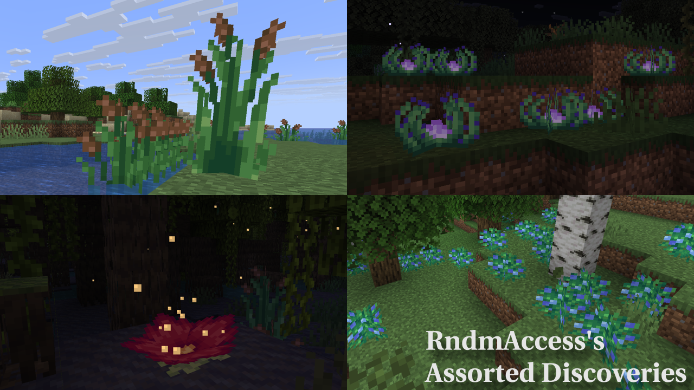

# Assorted Discoveries For Minecraft 1.21.11

## About

Experience Minecraft like never before with over 90 new plushies! As well as many other new vanilla style blocks,
food, and much, much more with Assorted Discoveries!

## Features

- New crops and dynamic planter boxes.
- Rope ladders of every wood type that can hang from blocks.
- Lots of new foods (including cakes and pies).
- Colored lanterns, campfires, and torches.
- Plushies of nearly every mob in the game!
- A new bouncy mushroom type.
- A new plant that releases particles.
- Rabbits can fall further before taking damage.
- And tons of new blocks as well as a few new variations for existing blocks.

## License

Assets for this project are licensed under All Rights Reserved. The code for this project 
is licensed under the MIT license. 
This license can be found here: [LICENSE](https://github.com/rndmaccess/assorted-discoveries-fabric/blob/1.21.11/LICENSE.md).

## Official Wiki

- Wiki link: [https://rndmaccess.github.io/assorted-discoveries-fabric/](https://rndmaccess.github.io/assorted-discoveries-fabric/)

## Download Links

- [Curseforge: https://www.curseforge.com/minecraft/mc-mods/assorted-discoveries](https://www.curseforge.com/minecraft/mc-mods/assorted-discoveries)
- [Modrinth: https://modrinth.com/mod/assorted-discoveries](https://modrinth.com/mod/assorted-discoveries)

## Building From Source

If you'd like to compile this mod yourself instead of downloading a pre-built release:

1. Clone this repository:
   ```bash
   git clone https://github.com/rndmaccess/assorted-discoveries-fabric.git
   ```

2. Navigate into the project directory:
   ```bash
   cd assorted-discoveries-fabric
   ```

3. (Optional) Switch to your desired Minecraft version branch. By default, cloning the repository places
   you on the branch tracking the latest version of Minecraft.
   To build for a different version, switch branches:
   ```bash
   # List all available branches
   git branch -a
   
   # Switch to a specific branch (e.g., replace '1.21.11' with your target version)
   git checkout 1.21.11
   ```

4. Run the Gradle build command:
    - **Windows:** `gradlew.bat build`
    - **macOS/Linux:** `./gradlew build`
5. Find the compiled `.jar` file inside the `build/libs/` directory.



